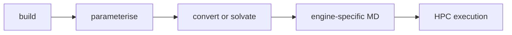

# iPHASimulator v2

PHA-specific RDKit tooling for building and validating simple oligomer structures.

## Builder levels

1. Curated common PHA library: `PHB`, `PHV`, `PHHx`, `PHHep`, `PHO`, `PHN`, `PHD`, and `PHDD`.
2. Generic linear alkyl-side-chain builder: `build_pha_by_sidechain(side_chain_carbons, degree)`.
3. Custom 3-hydroxy acid monomer builder: `build_custom_pha(monomer_smiles, degree, name)`.

## Project layout

- `src/iphasimulator/`: reusable package code.
- `src/iphasimulator/parameterization/`: AmberTools/GAFF2 workflow code.
- `src/iphasimulator/simulation/`: OpenMM and GROMACS workflow code.
- `src/iphasimulator/workflows/`: reusable notebook/example workflow helpers.
- `notebooks/`: step-by-step tutorials.
- `examples/`: thin command-line scripts.
- `docs/`: design notes.
- `tests/`: automated tests.

Generated structures and MD outputs are written under `examples/output/` and are ignored by Git. Exported PDB/SDF structure files live in `examples/output/polymer_structures/`.

## Tutorial notebooks

The tutorials are split by step:

1. `notebooks/01_build_pha_oligomers.ipynb`
2. `notebooks/02_design_polymer_for_user_request.ipynb`
3. `notebooks/03_validate_and_visualize.ipynb`
4. `notebooks/04_export_structures.ipynb`
5. `notebooks/05_gaff2_parameterisation.ipynb`
6. `notebooks/06A_openmm_dry_polymer.ipynb`
7. `notebooks/06B_gromacs_dry_polymer.ipynb`
8. `notebooks/06C_gromacs_solvated_system.ipynb`
9. `notebooks/06D_openmm_solvated_system.ipynb`
10. `notebooks/07_hpc_workflows.ipynb`

The notebooks are written as guided tutorials for non-specialist users. They
import reusable code from `src/iphasimulator`; they should not contain core
package logic.

Workflow map:



Run it with:

```bash
python -m pip install -e .
python -m pip install jupyterlab
jupyter lab notebooks/
```

Jupyter is an interactive development dependency, not a core runtime dependency.

To generate validation SDF/PDB files without Jupyter:

```bash
PYTHONPATH=src python examples/generate_validation_structures.py
```

For config-driven workstation or HPC runs:

```bash
PYTHONPATH=src python examples/run_configured_workflow.py --config examples/hpc_validation_workflow.yaml --dry-run
PYTHONPATH=src python examples/run_configured_workflow.py --config examples/hpc_validation_workflow.yaml
```

To prepare the alternative GROMACS route after GAFF2 parameterisation:

```bash
PYTHONPATH=src python examples/prepare_gromacs_from_gaff2.py --target PHB4
```

The MD output layout is workflow-oriented:

```text
examples/output/md_tests/<SYSTEM>/
    gaff2/
    gromacs/
        dry_polymer/
        solvated_polymer/
        charmm_gui_membrane/
    openmm/
        dry_polymer/
        solvated_polymer/
        advanced_workflows/
        debug/
```

GROMACS workflow folders under `examples/output/md_tests/PHB4/gromacs/`:

- `dry_polymer/` for polymer-only dry/vacuum minimisation debugging.
- `solvated_polymer/` for polymer + water + ions MD.
- `charmm_gui_membrane/` for optional CHARMM-GUI-style membrane/protein
  equilibration templates.

OpenMM dry validation writes to `openmm/dry_polymer/`. Explicit-solvent OpenMM
preparation writes to `openmm/solvated_polymer/`. Temporary smoke-test output,
belongs under `openmm/debug/` and is not part of the production workflow
documentation.

Each workflow folder has its own inputs and scripts where applicable, so
running one workflow does not modify another. Existing old mixed files directly
inside `examples/output/md_tests/<SYSTEM>/gromacs/` can be deleted and
regenerated.

The solvated workflow is reset-safe: `run_solvate_local.sh` copies fresh
polymer-only `topol.top` and `step5_input.gro` from `dry_polymer/`, removes old
generated solvation/minimisation files, then writes the final solvated and
neutralised starting structure back to `solvated_polymer/step5_input.gro`.
Do not rerun `gmx solvate` or `gmx genion` manually on an already modified
`topol.top`; rerun the generated script with clean/overwrite mode instead.

The simplified dry polymer workflow remains the default for PHA oligomer
validation. The solvated GROMACS and solvated OpenMM notebooks are the realistic
production-preparation routes once the dry validation succeeds. An
advanced Packmol builder is also available for future realistic PHA oligomer
systems with TIP3P water, NaCl, multiple polymers, and later enzyme/polymer
extensions:

```python
from iphasimulator.system_builders import build_packmol_solvated_system

build_packmol_solvated_system(
    ["examples/output/polymer_structures/PHB4_R.pdb"],
    "examples/output/md_tests/PHB4/packmol",
    box_size_nm=8.0,
    nacl_concentration_molar=0.15,
)
```

Running that advanced builder requires the `packmol` executable on `PATH`.

## MD workflow dependencies

Stage 1 uses AmberTools executables (`antechamber`, `parmchk2`, `tleap`). Stage 2 uses OpenMM with AMBER topology files.

Install the MD stack with conda-forge:

```bash
conda install -c conda-forge ambertools openmm parmed mdtraj -y
```

Activate the same conda environment before running the workflow:

```bash
conda activate <your-env>
which antechamber
which tleap
python -c "import openmm, parmed, mdtraj"
PYTHONPATH=src python3 examples/run_gaff2_openmm_test.py
```

The default workflow runs the smaller validation systems only: `PHB4`, `PHO4`,
and `PHDD4`. Larger systems such as `PHB8`, `PHO8`, and `PHDD8` are opt-in with
`--target` until the smaller systems are validated.

For faster AmberTools debugging without AM1-BCC charge generation:

```bash
PYTHONPATH=src python3 examples/run_gaff2_openmm_test.py --target PHB4 --skip-openmm --skip-am1-bcc
```

The workflow writes GAFF2/OpenMM outputs under `examples/output/md_tests/`,
including per-stage timing logs and separate raw `antechamber`/`sqm` logs.
Generated trajectories, checkpoints, and logs are under `examples/output/`,
which is ignored by Git by default and should not be committed.
