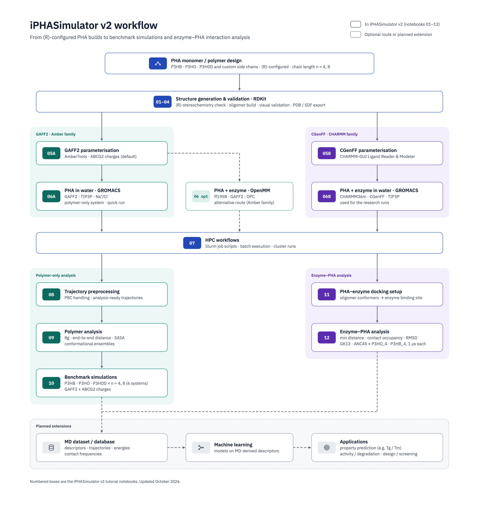

# iPHASimulator v2

Build PHA oligomers, prepare molecular simulations, and measure their structure
and contacts. iPHASimulator is organised around practical notebooks with reusable
Python helpers for polyhydroxyalkanoates (PHAs).

**New here?** Follow [installation](installation.md), then the
[P3HB_4 quick-start](quickstart.md). For existing MD trajectories, start with
[trajectory preprocessing](workflows/trajectory.md) or
[enzyme–PHA contacts](workflows/analysis.md).

## Workflow overview



Numbered boxes correspond to the tutorial notebooks; dashed outlines indicate
optional routes or planned extensions. See the [notebook catalogue](notebooks.md)
for prerequisites and run order.

## Choose your workflow

| Start with | Follow | Result |
| --- | --- | --- |
| A monomer code or 3-hydroxy-acid SMILES | [Polymer design](workflows/design.md) | An RDKit oligomer with a defined repeat count |
| A small oligomer structure | [GAFF2 parameterisation](workflows/gaff2.md) | AMBER topology, coordinates and parameter logs |
| AMBER parameters | [OpenMM / GROMACS preparation](workflows/simulation.md) | Engine-specific inputs and run folders |
| Prepared simulation inputs | [HPC execution](workflows/hpc.md) | A reviewed execution plan and SLURM script |
| Completed MD outputs | [Preprocessing](workflows/trajectory.md) → [analysis](workflows/analysis.md) | Processed trajectories, plots and tables |
| A candidate enzyme–PHA pair | [Docking preparation](workflows/docking.md) | Inputs and records for a manual docking workflow |

The teaching notebooks in `notebooks/` cover construction, parameter preparation,
simulation setup and selected analysis examples. Research analysis in
`src/md_simulation_scripts/` requires existing trajectories and system-specific
paths; it is separate from the teaching sequence. Read [the notebook catalogue](notebooks.md)
for prerequisites and run order. Documentation builds do not execute notebooks.


The naming distinguishes the monomer (`3HB`), polymer (`P3HB`), and a chain with
four repeats (`P3HB_4`). The [quick-start](quickstart.md) explains construction,
validation and export with that small example.

```{toctree}
:maxdepth: 2
:caption: Start here

installation
quickstart
capabilities
```

```{toctree}
:maxdepth: 2
:caption: Workflow tutorials

workflows/design
workflows/gaff2
workflows/simulation
workflows/optional_openmm
workflows/hpc
workflows/trajectory
enzyme_trajectory_processing
workflows/analysis
workflows/docking
notebooks
```

```{toctree}
:maxdepth: 1
:caption: Reference and contributing

api/index
enzyme_contacts
developer_guide
project_readme
contributing_docs
```

Source: [MMLabCodes/iPHAsimulatorV2](https://github.com/MMLabCodes/iPHAsimulatorV2).
The capabilities documented here are specific to this repository.
