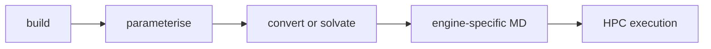

# Tutorial Notebooks

Run the notebooks in order:

1. `01_build_pha_oligomers.ipynb`
2. `02_design_polymer_for_user_request.ipynb`
3. `03_validate_and_visualize.ipynb`
4. `04_export_structures.ipynb`
5. `05_gaff2_parameterisation.ipynb`
6. `06_A_openmm_dry_polymer.ipynb`
7. `06_B_gromacs_dry_polymer.ipynb`
8. `06_C_solvated_system_setup.ipynb`
9. `06_D_charmm_gui_style_equilibration.ipynb`
10. `07_hpc_workflows.ipynb`
11. `08A_trajectory_preprocessing.ipynb`
12. `08_basic_polymer_analysis.ipynb`

The 06-series notebooks are workflow-oriented:

- `06_A`: OpenMM dry polymer validation and local debugging.
- `06_B`: AMBER to GROMACS conversion, dry GROMACS minimisation, and workflow comparison.
- `06_C`: explicit-solvent setup with box, water, ions, PME, simplified polymer NVT/NPT/production scripts, and scientific comparison to the staged workflow.
- `06_D`: CHARMM-GUI-style staged equilibration documentation for membrane proteins, enzyme systems, and sensitive complexes.
- `07`: HPC execution, SLURM submission, restart continuation, benchmarking, and performance tuning.
- `08A`: GROMACS trajectory preprocessing with reusable `[ center ]` index groups, PBC reconstruction, compact wrapping, fitting, and representative frame extraction.
- `08_basic_polymer_analysis`: analysis entry point that uses only `processed/` and `analysis_ready/` trajectories.

Compatibility notebooks with the older `06A`, `06B`, `06C`, and `06D_openmm_solvated_system` names are kept in the repository. The underscore-named notebooks are the clearer main tutorial sequence.

Workflow map:

These tutorials are written for users who may not be computational specialists.
They explain what each step means and keep editable input cells small.

Reusable Python logic belongs in `src/iphasimulator`. Notebook cells should guide
the workflow, not duplicate chemistry or simulation code.
