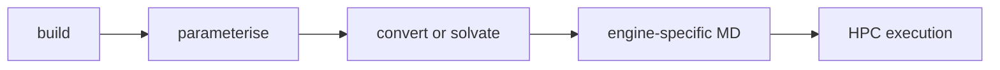

# Tutorial Notebooks

Run the notebooks in order:

1. `01_build_pha_oligomers.ipynb`
2. `02_design_polymer_for_user_request.ipynb`
3. `03_validate_and_visualize.ipynb`
4. `04_export_structures.ipynb`
5. `05_gaff2_parameterisation.ipynb`
6. `06A_openmm_dry_polymer.ipynb`
7. `06B_gromacs_dry_polymer.ipynb`
8. `06C_gromacs_solvated_system.ipynb`
9. `06D_openmm_solvated_system.ipynb`
10. `07_hpc_workflows.ipynb`
11. `08_trajectory_preprocessing.ipynb`
12. `09_basic_polymer_analysis.ipynb`
13. `10_batch_md_benchmark.ipynb`
14. `11_PHA_Enzyme_Docking.ipynb`

The 06-series notebooks are workflow-oriented:

- `05`: GAFF2 parameterisation and the roadmap explaining why the workflow branches after parameterisation.
- `06A`: OpenMM dry polymer validation and local debugging.
- `06B`: AMBER to GROMACS conversion and dry GROMACS minimisation.
- `06C`: explicit-solvent GROMACS preparation with box, water, ions, PME, and NVT/NPT/production scripts.
- `06D`: explicit-solvent OpenMM setup template.
- `07`: HPC execution, SLURM submission, restart continuation, benchmarking, and performance tuning.
- `08`: GROMACS trajectory preprocessing with reusable `[ center ]` index groups, PBC reconstruction, compact wrapping, optional fitting, and representative frame extraction.
- `09_basic_polymer_analysis`: analysis entry point that uses the centered trajectory by default.
- `10_batch_md_benchmark`: workflow log, launcher, and progress checker for the six-system MD benchmark.
- `11_PHA_Enzyme_Docking`: prepares benchmark PHA oligomer PDB inputs and job notes for manual HADDOCK docking.

Workflow map:

These tutorials are written for users who may not be computational specialists.
They explain what each step means and keep editable input cells small.

Reusable Python logic belongs in `src/iphasimulator`. Notebook cells should guide
the workflow, not duplicate chemistry or simulation code.
